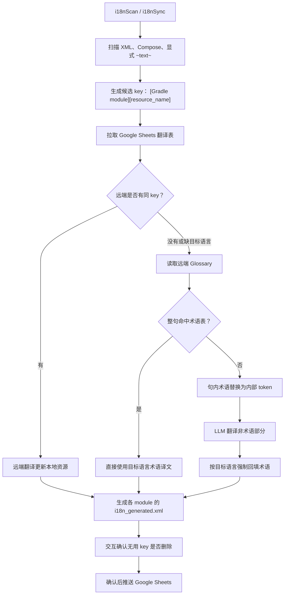

# i18n-google-android-scan

Android 的硬编码文案扫描、资源提取、Google Sheets 同步与 LLM 翻译 Gradle 插件。

## 已确认的设计

- 默认语言为中文；目标语言可配置，例如 `en`、`zh-TW`。
- Google Sheets 中相同的 `[Gradle module][resource_name]` 以远端翻译为主。
- 远端没有 key 或缺少目标语言时，调用项目配置的 LLM 直接补齐翻译。
- 每条 LLM 翻译都必须经过远端 Google Sheets 术语表。
- 术语表完全命中时，直接使用目标语言术语译文，不调用 LLM。
- 句内命中术语时，插件先使用内部 token 保护术语；LLM 只翻译其余文本，随后强制回填目标语言术语译文。
- `~text~` 是源码中的强制扫描标记；写入资源前会移除 `~`。它与 LLM 术语保护 token 不共用。
- XML 与 Compose 是首期自动替换范围。ViewModel 仅在 `UiText`/`@StringRes` 等安全上下文自动替换；Repository/Domain 仅报告，不直接引入 `R.string` 依赖。
- 每个 Gradle module 在各语言目录下由插件独占维护 `i18n_generated.xml`；不修改人工维护的 `strings.xml`。
- 无用 key 默认不删除；手动同步时可交互确认删除，然后才会同步到 Google Sheets。
- CI 只做 `i18nCheck`，不调用模型、不修改源码、不推送 Google Sheets。

## 流程



## 当前骨架任务

```bash
./gradlew i18nScan
./gradlew i18nCheck
./gradlew i18nSync
```

当前已实现 `i18nScan` 的 XML、Compose 与 `~text~` 候选扫描，并将结果输出至：

```text
build/reports/i18n/scan.json
```

后续实现顺序：安全源码改写、Android XML 生成、Google Sheets 双向同步、术语 token 回填、OpenAI-compatible LLM 客户端、无用资源交互清理。

## 使用配置示例

```kotlin
plugins {
    id("com.xiaopengqin.i18n-google-android-scan") version "0.1.0-SNAPSHOT"
}

androidI18n {
    sourceLocale.set("zh-CN")
    targetLocales.set(listOf("en", "zh-TW"))
    sourceMarker.set("~")

    googleSheet {
        spreadsheetId.set("translation-spreadsheet-id")
        sheetName.set("android_translations")
    }

    glossary {
        enabled.set(true)
        spreadsheetId.set("glossary-spreadsheet-id")
        sheetName.set("glossary")
        failOnMissingTargetTranslation.set(true)
    }

    llm {
        baseUrl.set("https://your-openai-compatible-endpoint/v1")
        apiKey.set(providers.environmentVariable("I18N_LLM_API_KEY"))
        model.set("your-model")
        promptFile.set(layout.projectDirectory.file("i18n/prompt.md"))
    }
}
```

## Google Sheets 术语表格式

| zh-CN | en | zh-TW | note |
|---|---|---|---|
| Ed | Ed | Ed | 品牌角色名 |
| 投资组合 | Portfolio | 投資組合 | 金融术语 |
| 信号 | Signal | 訊號 | 金融术语 |

术语表由项目维护，插件只读。若源术语命中、但目标语言列为空，插件将失败而不是让 LLM 自行翻译该术语。
